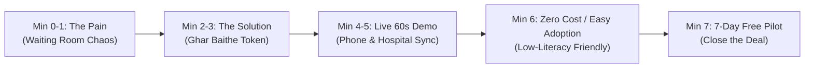

# 🏥 OPD Token Live — Doctor & Hospital Pitch Presentation Playbook

A practical, field-tested guide and presentation deck designed for visiting doctors, clinic owners, and hospital OPD administrators to pitch the **OPD Token Live** platform.

---

## ⏱️ The 7-Minute Meeting Framework

When meeting busy doctors, you usually have **less than 10 minutes**. Structure your conversation as follows:



---

## 📊 Slide-by-Slide Pitch Presentation

```carousel
### Slide 1: The Problem
# The Daily OPD Reality: Noise, Crowding & Lost Patients
- **Overcrowded Waiting Rooms**: 40–50 patients packed in small corridors for 2–3 hours.
- **Reception Burnout**: Staff answering *"Mera number kab aayega?"* 200 times a day.
- **Lost OPD Consultations**: Patients getting frustrated by delays and leaving for nearby clinics.
- **Infection Risk**: Sick and elderly patients sitting together in congested rooms.
<!-- slide -->
### Slide 2: The Solution
# "Ghar Baithe Token, Seedhe OPD Room"
- Patient books OPD token sitting at home on their mobile.
- Real-time queue tracker shows exact waiting count: *"4 people ahead of you"*.
- Patient relaxes at home and travels to the clinic **only when their turn is near**.
- Patient arrives, hears their token called, and walks directly into the doctor's room.
<!-- slide -->
### Slide 3: For Doctor & Hospital Staff
# 1-Click Zero-Stress Queue Management
- **Zero Software Installation**: Runs directly on any existing smartphone, tablet, or reception PC browser.
- **1-Click Call Next**: Staff presses **"CALL NEXT PATIENT"**, next token is displayed and announced automatically.
- **Doctor-Wise Segregation**: Separate independent queues for Cardiologist, Pediatrician, General OPD, etc.
- **Walk-in & Emergency Ready**: Reception can insert walk-in patients or emergency tokens instantly.
<!-- slide -->
### Slide 4: Low-Literacy & Elderly Friendly
# Designed for Every Patient (No Tech Skills Needed)
- **Large Doctor Profile Photos**: Patients recognize their doctor visually.
- **Big Numerals & Visual Icons**: Heart ❤️, Child 👶, Fever 🤒 with clear body parts.
- **Audio Voice Support (हिंदी व English)**: Tapping the speaker icon speaks token details aloud.
- **Color-Coded Status**: 🟢 Green = Relax at home, 🟡 Yellow = Start coming to hospital, 🔴 Red = Your turn now!
<!-- slide -->
### Slide 5: Platform Economics
# First 3 Tokens FREE • Nominal ₹10 Platform Fee
- **100% Free Trial for Patients**: First 3 OPD tokens are completely FREE (`₹0`).
- **₹10 Convenience Fee**: From the 4th token onwards, a nominal ₹10 platform fee applies.
- **Zero Financial Burden on Hospital**: No setup fees, no monthly software subscription, no server maintenance cost.
- **Increases Hospital Patient Inflow**: Organized queueing attracts patients who hate long waiting times.
<!-- slide -->
### Slide 6: The Closing Offer
# 7-Day Zero-Risk Free Pilot in 1 OPD Room
- Let us set up your OPD room today in **under 2 minutes**.
- Run it for 7 days with zero commitment.
- If your waiting room isn't 80% quieter and your staff isn't 10x happier, cancel with 1 click.
```

---

## 🗣️ In-Person Word-by-Word Doctor Pitch Script

### 1. Opening & Hook (First 60 Seconds)
> *"Namaste Doctor Sahab! Main aapka sirf 5 minute lene aaya hoon.
> Roz subah aapke clinic aur waiting hall mein 30-40 log bheed lagakar khade rehte hain. Aapke reception staff ka aadha time bas yahi batane mein nikal jata hai ki 'aapka number 1 ghante baad aayega'. Aur kai baar lambi line dekhkar patient doosre clinic chala jata hai.
> 
> Kya ho agar patient ghar baithe aapka token le sake, mobile par live dekhe ki uske aage kitne log hain, aur clinic tabhi aaye jab uska number aane wala ho? Isse aapka waiting hall bilkul shaant rahega aur patient ka experience 10 guna behtar ho jayega."*

### 2. Live Demo Cue (Next 90 Seconds)
*(Take out your tablet or phone showing the app in Dual View)*

> *"Doctor Sahab, dekhiye yeh kaise kaam karta hai:
> 1. Yeh left side par patient ka phone hai jo ghar par baitha hai. Usne aapki photo par tap kiya aur **Token #25** mil gaya.
> 2. Right side par aapke reception ka screen hai. Dekhiye, Token #25 turant aapki list mein live jud gaya!
> 3. Jaise hi aapka pehla patient khatam hua, aapke staff ne dabaya **'CALL NEXT'**.
> 4. Turant bell baji, Hindi mein aawaz aayi, aur patient ke phone par alert aa gaya: 'Aapki baari aa gayi hai, Room 204 mein padharein!'"*

### 3. Addressing Illiterate & Rural Patients
> *"Aap soch rahe honge ki anpadh ya buzurg log kaise use karenge? 
> Humne ise bilkul simple banaya hai — badi photo, bade number, aur speaker ka button. Agar patient padh nahi sakta, toh wo speaker dabakar Hindi mein sun sakta hai. Koi form ya English likhna nahi hai."*

### 4. Pricing & Closing Pilot Offer
> *"Sabse achhi baat: Hospital ke liye yeh bilkul FREE hai. Koi software charge nahi, koi setup cost nahi. Patient ko bhi pehle 3 token bilkul muft milte hain, uske baad sirf ₹10 ka token shulk lagta hai.
> 
> Hum chahte hain ki aap kal se 1 OPD room mein iska 7-din ka Free Trial shuru karein. Agar aapko aur aapke patients ko pasand na aaye, toh koi baat nahi. Kya hum kal subah se ise test kar sakte hain?"*

---

## 🛡️ Top 6 Objections & Winning Answers

### Q1: *"Hamare paas gaon aur anpadh log aate hain, wo smartphone se token kaise lenge?"*
**Winning Answer:**
> *"Doctor Sahab, aaj gaon mein bhi har ghar mein WhatsApp aur YouTube chal raha hai. Humne is app mein padhna-likhna bilkul khatam kar diya hai. Badi doctor photo, bimari ka symbol (❤️ dil, 👶 bachha), aur speaker icon diya hai jo Hindi mein bol kar batata hai. Aur jo buzurg hain, unka token unke beta ya padosi ghar baithe 10 second mein book kar dete hain."*

### Q2: *"Jo patient direct clinic aa jaye bina phone ke, unka kya hoga?"*
**Winning Answer:**
> *"Reception desk par ek click mein 'Walk-in / Emergency Token' ka button hai. Agar koi patient seedhe counter par aata hai, toh staff use turant counter token de sakta hai jo usi live line mein fit ho jata hai. Koi bhi patient bina ilaaj ke nahi rahega."*

### Q3: *"Kya hume naya computer, TV ya hardware khareedna padega?"*
**Winning Answer:**
> *"Bilkul nahi! Aapke reception par jo normal computer, laptop ya staff ka smartphone hai, usi par browser mein yeh chalta hai. Agar waiting hall mein normal TV hai, toh uspar bhi yeh full screen dikha sakte hain. Zero hardware investment."*

### Q4: *"Agar doctor kisi emergency mein late ho jaye ya operation mein chala jaye?"*
**Winning Answer:**
> *"Reception desk par ek button hai: **'PAUSE QUEUE'**. Jaise hi doctor late hote hain, sabhi patients ke mobile par live message chala jata hai ki doctor emergency mein hain, kripya aane mein thoda samay lein. Isse clinic mein bheed aur gussa bilkul nahi hota."*

### Q5: *"Platform patient se ₹10 kyu leta hai?"*
**Winning Answer:**
> *"Pehle 3 token sabhi ke liye 100% FREE hain. Uske baad ₹10 ek chhota sa convenience charge hai. Patient ka aane-jaane ka auto-rikshaw ka kiraya, clinic mein 2 ghante garmi mein baithne ka samay, aur bheed se bachta hai. 2 ghante bachane ke liye koi bhi khushi se ₹10 deta hai."*

### Q6: *"Hospital ko kya fayda hai?"*
**Winning Answer:**
> *"Teen bade fayde hain:
> 1. **Reputation & Patient Growth**: Log unhi clinics mein dobara aate hain jahan unka samay bachta hai.
> 2. **Peaceful Reception**: Staff ka 80% phone call aur ladaai-jhagda khatam.
> 3. **Higher Daily Patient Capacity**: Queue organized hone se doctor din bhar mein 15-20% zyada patients bina thake dekh sakte hain."*

---

## 📄 Printable Leave-Behind Pamphlet (1-Page Flyer)

```
┌────────────────────────────────────────────────────────────────────────┐
│                      🏥 OPD TOKEN LIVE                                │
│       स्मार्ट ओपीडी टोकन प्रणाली — अस्पताल और मरीजों के लिए वरदान     │
├────────────────────────────────────────────────────────────────────────┤
│                                                                        │
│   ❌ पुरानी ओपीडी की समस्याएं:                                           │
│   • 2 से 3 घंटे लाइन में खड़े रहने की मजबूरी                           │
│   • रिसेप्शन पर मरीजों की धक्का-मुक्की और तनाव                          │
│   • लंबी लाइन देखकर मरीजों का लौट जाना                                 │
│                                                                        │
│   ✅ OPD TOKEN LIVE का समाधान:                                        │
│   1. घर बैठे 1 क्लिक में डॉक्टर का टोकन पाएं                           │
│   2. मोबाइल पर देखें कि आपके आगे कितने मरीज हैं                        │
│   3. अपनी बारी आने पर ही अस्पताल पधारें                                │
│   4. बुजुर्गों और अनपढ़ लोगों के लिए हिंदी व फोटो आधारित सुविधा        │
│                                                                        │
│   🎁 मरीजों के लिए पहले 3 टोकन बिल्कुल मुफ़्त (FREE)                    │
│   🏥 अस्पताल के लिए शून्य सेटअप शुल्क (Zero Setup Cost)                 │
│                                                                        │
│   📞 अपने अस्पताल / क्लिनिक में शुरू करने के लिए संपर्क करें:          │
│   फोन: 1800-22-4488 / +91-98765-XXXXX                                  │
│   वेबसाइट: www.opdtokenlive.com                                        │
└────────────────────────────────────────────────────────────────────────┘
```
